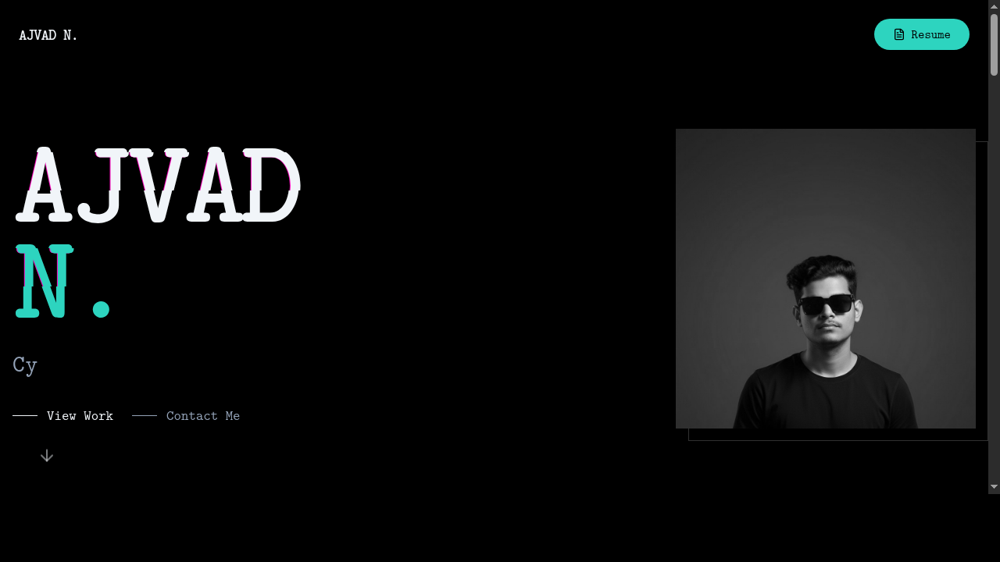
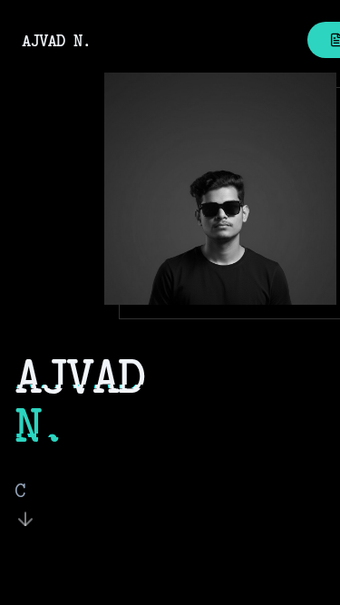

<div align="center">

# 🛡️ AJVAD N.
### Cybersecurity Analyst & Ethical Hacker

[](https://portfolio-ajvad-n.vercel.app)
[](https://github.com/Ajvadn)
[](https://www.linkedin.com/in/ajvad-n/)
[](mailto:ajvadaju2003@gmail.com)

### 🌐 [Live Demo](https://portfolio-ajvad-n.vercel.app)

<p align="center">
  
</p>

**"Securing the digital frontier, one vulnerability at a time."**

A high-performance, dark-themed portfolio built to showcase my journey in **Offensive Security**, **Red Teaming**, and **Threat Analysis**.

</div>

---

## ⚡ Features

-   **🎨 Midnight Slate Theme**: A deep, immersive dark mode inspired by terminal aesthetics and AMOLED displays.
-   **👾 Glitch & Typewriter Effects**: Cyberpunk-inspired animations that bring the interface to life.
-   **📱 Fully Responsive**: Optimized for every device, from 4K monitors to mobile screens.
-   **🚀 Blazing Fast**: Built with Astro's island architecture for zero-JS default performance.
-   **🧩 Modular Design**: Clean, component-based architecture using React and Tailwind CSS.

## 📸 Screenshots

<div align="center">
  
  <p><i>Desktop View</i></p>
  
  <br />
  
  
  <p><i>Mobile View</i></p>
</div>

## 🛠️ Tech Stack

<div align="center">


</div>

## 📂 Project Structure

```text
/
├── public/             # Static assets (fonts, images, resume)
├── src/
│   ├── components/     # UI Components (Hero, Projects, Certifications)
│   ├── layouts/        # Base layouts (Head, SEO, Global Styles)
│   ├── pages/          # Route definitions
│   └── styles/         # Global CSS & Tailwind directives
├── astro.config.mjs    # Astro configuration
└── tailwind.config.mjs # Tailwind configuration
```

## 🚀 Getting Started

### Prerequisites

-   **Node.js** (v18+)
-   **pnpm** (Recommended) or npm/yarn

### Installation

1.  **Clone the repository**
    ```bash
    git clone https://github.com/Ajvadn/portfolio-ajvad.git
    cd portfolio-ajvad
    ```

2.  **Install dependencies**
    ```bash
    pnpm install
    ```

3.  **Start the dev server**
    ```bash
    pnpm run dev
    ```
    Access the site at `http://localhost:4321`

## 🏗️ Build & Deploy

To create a production build:

```bash
pnpm run build
```

The output will be in the `dist/` directory, ready for deployment to Vercel, Netlify, or any static host.

## 📄 License

This project is open source and available under the [MIT License](LICENSE).

---

<div align="center">
  <p>Designed & Built with 💻 by <b>Ajvad N.</b></p>
  <p><i>© 2025 All Rights Reserved</i></p>
</div>
